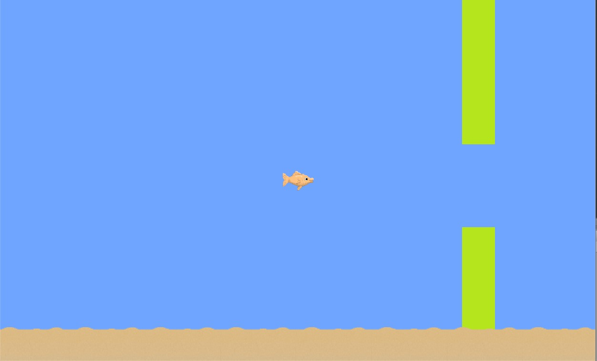
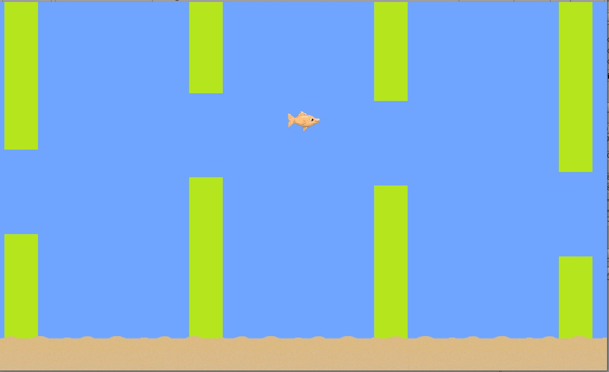

# Unity environment for reinforcement learning

## Introduction
This is a flappy bird like environment created using Unity. There are two brains: `PlayerBrain` which can be used to manually play the game and `LearningBrain` which is used to train a model from a python script.

### Actions
There is only one action: jump (1). This Using PlayerBrain you can jump using `SPACE` 
Not jumping is treated as 0

### Rewards
The agent gets +1 reward for every time step it is alive and -10 penalty when it dies. 
Death is caused by going off screen or colliding with the pipes (seaweed)

### Note
This is my first Unity project so I am sure there are areas which can be improved and I encourage you to do so. 
Every reference to 'seaweed' in the code is actually the pipes. This is because the seaweed art was replaced with pipes at a later stage as the seaweed seemed to add complexity to the environment making it harder to train in. 
Heavily inspired by this tutorial: https://youtu.be/soUg0HfpSlg

### Screenshots
This is the starting screen:

 
 
Another mid game screenshot:
